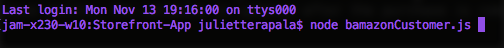

# Storefront-App
### Week 12 Homework: Node.js &amp; MySQL Assignment: Storefront CLI App

## Overview

*Storefront-App* is a CLI app that lets users load items from a MySQL database and purchase a specific quantity of items all via the command line. When a user makes a request to purchase, the quantity desired is checked against the database before the purchase is made. If an appropriate quanity of product exists, the database is updated after the purchase is completed. 

## Walkthrough

1. After installing your dependencies using `npm install`, use node to run `bamazonCustomer.js`

## Dependencies
* **mysql NPM Package:** A node.js driver for MySQL.
* **inquirer NPM Package:** Used to prompt user for input via the console (e.g. product to purchase, quantity to purchase).
* **is-number NPM Package:** Used to check if a quantity entered by user is a numerical value.
* **console.table NPM Package:** Lets you print an array of JavaScript objects as a table in your console.

