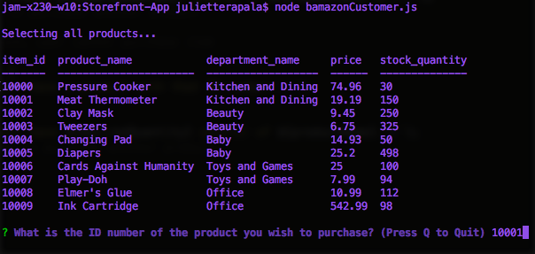
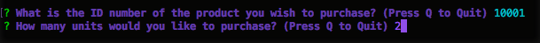
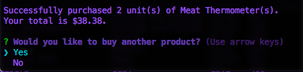
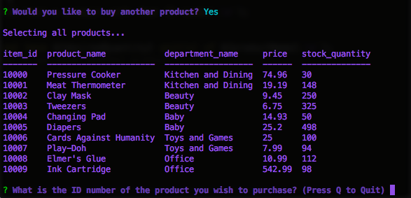
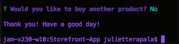
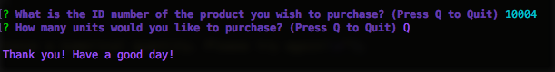
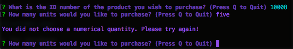
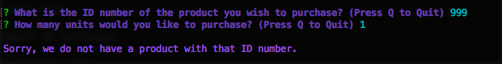

# Storefront-App
### Week 12 Homework: Node.js &amp; MySQL Assignment: Storefront CLI App

## Overview

*Storefront-App* is a CLI app that lets users load items from a MySQL database and purchase a specific quantity of items all via the command line. When a user makes a request to purchase, the quantity desired is checked against the database before the purchase is made. If an appropriate quanity of product exists, the database is updated after the purchase is completed. 

This application provides a simple way for a user to interact with an inventory database that a store may have for their products. A user's purchase will immediately update the database. The syntax I used to build the database that I am using in my examples can be found in `storefrontschema.sql`.

## Walkthrough

1. After installing your dependencies using `npm install`, use node to run `bamazonCustomer.js`

	

2. On load, the application with display all items available to purchase. Make your selection by typing in the ID number of the product you wish to purchase.

	

3. Once a product is chosen, enter the quantity of products you wish to purchase.

	

4. If the desired quantity of product exists, your purchase will be successful, and you will be asked if you would like to purchase another product.

	

5. If you would like to purchase another product, the items will load with their updated stock quantities.

	

6. If you did not want to purchase another product, the application will quit.

	

## Notes

* You may also quit by pressing "Q" on any of the purchase prompts.

	

* You must enter a numerical quantity of product to purchase.

	

* You must enter an ID number that exists in the database.

	

## Dependencies
* **mysql NPM Package:** A node.js driver for MySQL.
* **inquirer NPM Package:** Used to prompt user for input via the console (e.g. product to purchase, quantity to purchase).
* **is-number NPM Package:** Used to check if a quantity entered by user is a numerical value.
* **console.table NPM Package:** Lets you print an array of JavaScript objects as a table in your console.

