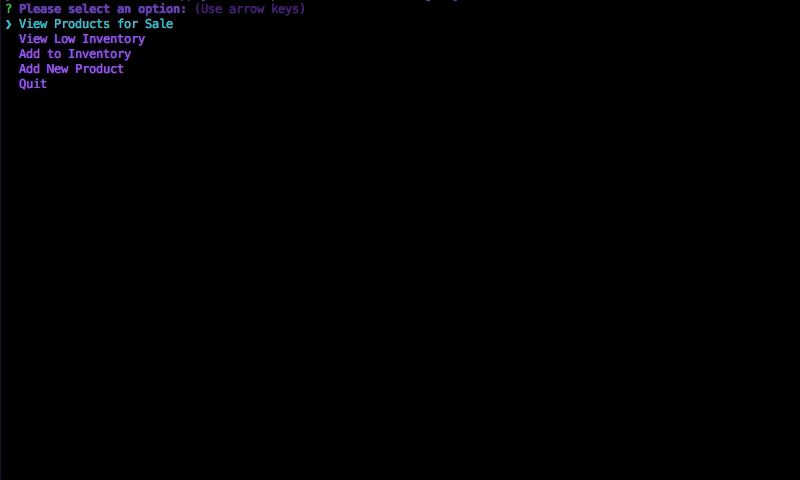

# Storefront-App
### Week 12 Homework: Node.js &amp; MySQL Assignment: Storefront CLI App

---
## Overview

*Storefront-App* is a CLI app that lets users load items from a MySQL database and interact with the database according to their role. All interactions occur via the command line.

As a Customer, a user may purchase a specific quantity of items available in the store. When a user makes a request to purchase, the quantity desired is checked against the database before the purchase is made. If an appropriate quantity of product exists, the purchase is completed, and the database is updated.

As a Manager, a user may choose to do any of the following:

1. View all products that are for sale.
2. View products that are low in inventory (in this case, fewer than 5 units in stock).
3. Add more inventory to an existing product. This will update the database.
4. Add a new product to the store. This will update the database.

This application provides a simple way for a user to interact with an inventory database that a store may have for their products. 
Different script exists for different roles (customer or manager), which provide the appropriate actions each role may need.

The syntax I used to build the database that I am using in my examples can be found in `storefrontschema.sql`.

---
## Customer View Walkthrough - `bamazonCustomer.js` 

1. After installing your dependencies using `npm install`, use node to run `bamazonCustomer.js`

	

2. On load, the application with display all items available to purchase. Make your selection by typing in the ID number of the product you wish to purchase.

	

3. Once a product is chosen, enter the quantity of products you wish to purchase.

	

4. If the desired quantity of product exists, your purchase will be successful, you will be shown your grand total, and you will be asked if you would like to purchase another product.

	

5. If you would like to purchase another product, the items will load with their updated stock quantities.

	

6. If you did not want to purchase another product, the application will quit.

	

## Customer View Notes

* You may also quit by pressing "Q" on any of the purchase prompts.

	

* You must enter a numerical quantity of product to purchase.

	

* You must enter an ID number that exists in the database.

	

* No purchase will be made if the desired quantity is zero.

	

---
## Manager View Walkthrough - `bamazonManager.js` 

1. After installing your dependencies using `npm install`, use node to run `bamazonManager.js`

	

2. On load, you will be given four options to choose from:

	

3. `View Product For Sale`: Choosing this option will display all items available to purchase. 

	

4. `View Low Inventory`: Choosing this option will display any products that are low in inventory (less than 5 units available).
	
	

5. `Add to Inventory`: Choosing this option will prompt the user for the ID of a product they wish to increase the inventory of, as well as the number of units they wish to add. Once entered, the database is updated, and a message will confirm the update.

	

6. `Add New Product`: Choosing this option will prompt the user for the name of a product, the department of the product, the price of the product, and the stock quantity of the product. Once entered, the database is updated, and all items available in the store are displayed to confirm. The ID of the new product is automatically generated.

	

7. `Quit`: Choosing this option will quit the application.

	

## Dependencies
* **mysql NPM Package:** A node.js driver for MySQL.
* **inquirer NPM Package:** Used to prompt user for input via the console (e.g. product to purchase, quantity to purchase).
* **is-number NPM Package:** Used to check if a quantity entered by user is a numerical value.
* **console.table NPM Package:** Lets you print an array of JavaScript objects as a table in your console.

